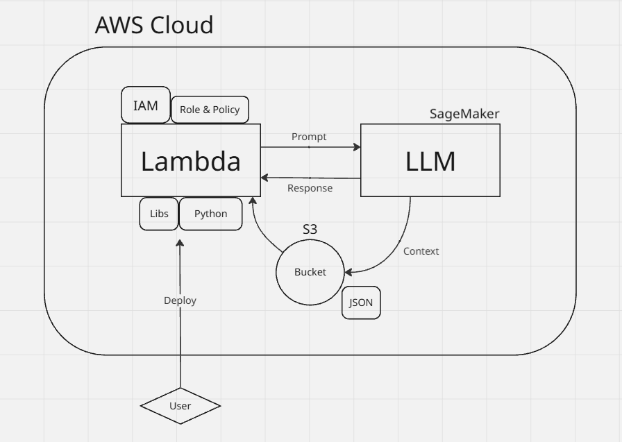

# Serverless AI Video Game Expert on AWS

This project demonstrates how to build a serverless AI assistant using AWS Lambda to query a Large Language Model (LLM) hosted on Amazon SageMaker. The assistant can answer general video game questions and, optionally, provide pricing information by fetching data from an S3 bucket.

Complete story written in my [Medium](https://medium.com/@karldritz/simple-aws-cloud-llm-implementation-project-09405c17dfcd)

## Features

*   Responds to general video game-related questions.
*   Can look up pricing information for consoles/games if data is provided in S3.
*   Serverless architecture using AWS Lambda.
*   Integrates with Amazon SageMaker for LLM inference.
*   Uses Amazon S3 for storing dynamic pricing data.
*   Secure access managed by AWS IAM.

## Architecture



## Prerequisites

*   AWS Account
*   A Deployed SageMaker LLM Endpoint with a known `EndpointName` and `InferenceComponentName`.
*   Your AWS Account ID.
*   The AWS Region you are working in.
*   Python 3.9+

## Setup & Deployment

**1. Prepare Pricing Data (Optional)**

   *   Create a `console_pricing.json` file.
   *   Create an S3 bucket.
   *   Upload `console_pricing.json` to this bucket.

**2. Create IAM Role**

   *   Go to the IAM console in AWS.
   *   Create a new role for Lambda:
        *   **Name:** `lambda-video-game-assistant-role`
        *   **Trusted Entity:** AWS service - Lambda
        *   **Permissions Policy (Managed):** `AWSLambdaBasicExecutionRole`
        *   **Permissions Policy (Inline):** Create an inline policy named `LambdaSageMakerS3AccessPolicy` with the JSON below.
           **Replace ALL placeholders (`<YOUR_...>` values)!**

     ```json
     {
         "Version": "2012-10-17",
         "Statement": [
             {
                 "Sid": "AllowInvokeSageMakerEndpoint",
                 "Effect": "Allow",
                 "Action": "sagemaker:InvokeEndpoint",
                 "Resource": [
                     "arn:aws:sagemaker:<YOUR_REGION>:<YOUR_AWS_ACCOUNT_ID>:endpoint/<YOUR_SAGEMAKER_ENDPOINT_NAME>",
                     "arn:aws:sagemaker:<YOUR_REGION>:<YOUR_AWS_ACCOUNT_ID>:inference-component/<YOUR_INFERENCE_COMPONENT_NAME>"
                 ]
             },
             {
                 "Sid": "AllowS3GetObject",
                 "Effect": "Allow",
                 "Action": "s3:GetObject",
                 "Resource": "arn:aws:s3:::<YOUR_S3_BUCKET_NAME>/console_pricing.json"
             }
         ]
     }
     ```

**3. Create Lambda Function**

   *   Go to the Lambda console.
   *   Click "Create function" (Author from scratch).
   *   **Function name:** `VideoGameExpertLLM`
   *   **Runtime:** Python 3.12 (or latest)
   *   **Architecture:** `x86_64`
   *   **Permissions:** Use an existing role -> select `lambda-video-game-assistant-role`.
   *   Click "Create function."

**4. Configure Lambda & Deploy Code**

   *   Open your Lambda function.
   *   **Configuration -> General configuration -> Edit:**
        *   Set **Timeout** to `1 min 0 sec`. Save.
   *   **Code source:**
        *   Copy the content of `lambda_function.py` from this repository (or the documentation).
        *   Paste it into the `lambda_function.py` editor in the console.
        *   **IMPORTANT:** Update the following variables at the top of the script with your actual values:
            *   `S3_BUCKET_NAME = 'YOUR_S3_BUCKET_NAME'`
            *   `SAGEMAKER_ENDPOINT_NAME = 'YOUR_SAGEMAKER_ENDPOINT_NAME'`
            *   `SAGEMAKER_INFERENCE_COMPONENT = 'YOUR_INFERENCE_COMPONENT_NAME'` (can be same as endpoint or remove if not used by your model)
        *   Click **"Deploy"**.

**5. Test**

   *   Go to the "Test" tab in your Lambda function.
   *   Create a new test event:
        *   **Event name:** `MyTestEvent`
        *   **Event JSON:**
          ```json
          {
            "user_input": "Tell me about the original Zelda game."
          }
          ```
   *   Click "Test." Check the execution results and logs.

**Cost Considerations**

   *   AWS Lambda: Free tier available; then pay-per-request and duration.
   *   Amazon SageMaker: Potentially significant cost. Billed for endpoint instance uptime. Shut down endpoints when not in use during development to save costs.
   *   Amazon S3: Negligible for small data storage and infrequent access.]
   *   Amazon CloudWatch: Free tier for logs; usually low cost.
   *   Monitor costs via AWS Cost Explorer.

**Limitations**

These are the limitations that I identified:
 *   LLM knowledge is static based on its training date.
 *   Response quality depends heavily on prompt engineering.
 *   Potential for "cold starts" on Lambda and SageMaker.
 *   Requires a pre-deployed SageMaker LLM endpoint.

**Future Improvements**
 *   Use Lambda environment variables for configuration.
 *   Implement more robust error handling.
 *   Add an API Gateway for public access with authentication.
 *   Explore SageMaker Serverless Inference for cost optimization on intermittent workloads.

---

emember to **test thoroughly** and **replace all placeholder values** with your actual configuration. Good luck!
